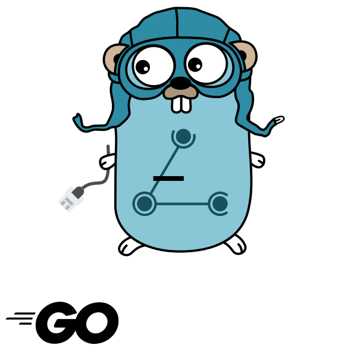

    /

go-babel is an (incomplete) implementation of the [Babel routing protocol](https://www.irif.fr/~jch/software/babel/) ([RFC8966](https://datatracker.ietf.org/doc/html/rfc8966)) in the Go programming language.

## References

- <https://www.irif.fr/~jch/software/babel/>
- <https://www.youtube.com/watch?v=Mflw4BuksHQ>

## Authors

- Steffen Vogel (@stv0g)

## License

go-babel is licenses under the Apache 2.0 license.

SPDX-FileCopyrightText: 2023 Steffen Vogel <post@steffenvogel.de>
SPDX-License-Identifier: Apache-2.0
